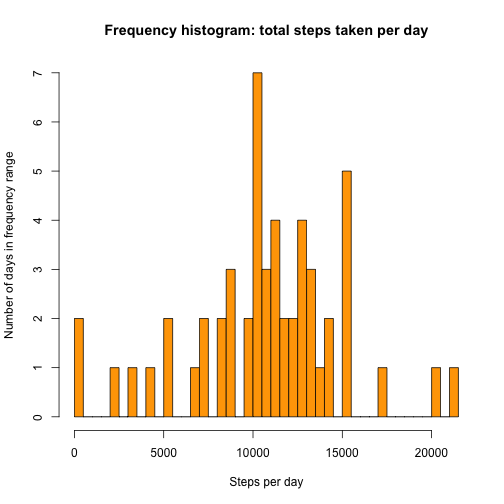
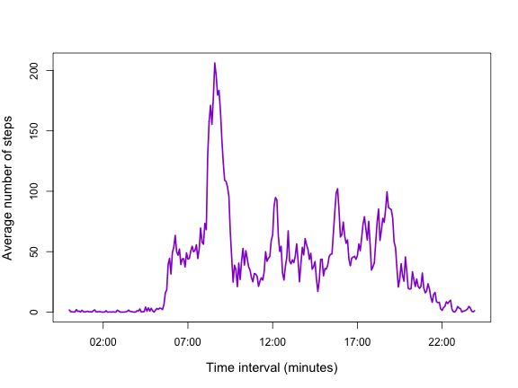
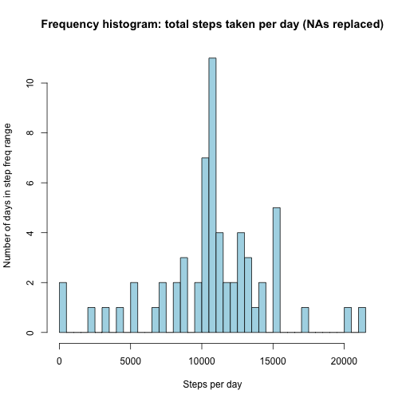
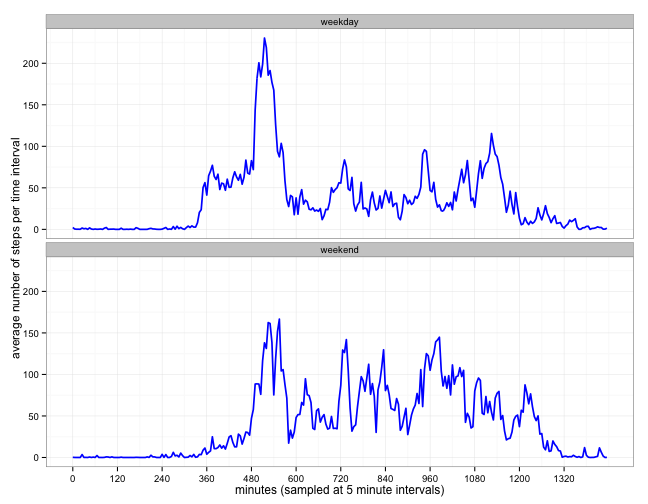

## Testing the CLT via simulation in R

#### Natalia Chodelski - 7 April 2015

#### Loading and pre-processing the data  


```r
# set working directory to the folder where i have 'activity.csv'
setwd("/Users/Natalia/Coding/Reproducible_Research/")
activity <- read.csv("activity.csv", header = T)
```
 

I processed the data by turning the given dates and time intervals into R POSITX date-time format.  I first used str_pad() to add zeros to the front of shorter time intervals so all time intervals were 4 digits long in 24 hr time format. I then pasted the time strings onto the date strings, and processed into POSITX format using strptime().


```r
library(stringr) # pad time intervals with zeros 
activity$time <- str_pad(activity$interval, 4, pad = "0") 
activity$datetime <- paste(activity$date, activity$time)  # pasting together
activity$R_time <- strptime(activity$datetime, format = "%Y-%m-%d %H%M")  # interpreting
```
<br>  
  
#### Mean steps per day

I calculated the mean  number of steps taken per day, using tapply, with simplify = TRUE to the result to an array.  I created a data frame by using column-bind to join an array of the unique dates to the mean number of steps.  I lastly assigned tidy column names.the rownames of the summarized steps (which are the dates) with the mean number of steps per day.  I lastly assigned tidy column names to this new data frame.


```r
mean_steps <- tapply(X = activity$steps, INDEX = activity$date, FUN = mean, simplify = T)
mean_steps_table <- data.frame(rownames(mean_steps), mean_steps)
colnames(mean_steps_table) <- c("Date measured","Mean_steps")  # renaming with tidy names
```
<br>  

I then used the xtable package to create and print a tidy HTML table of the mean steps per day.


```r
library(xtable)
table <- xtable(mean_steps_table, align = c("c","c","c"))
print(table, type="html", include.rownames = FALSE)
```

<!-- html table generated in R 3.1.2 by xtable 1.7-4 package -->
<!-- Wed Apr  8 13:07:39 2015 -->
<table border=1>
<tr> <th> Date measured </th> <th> Mean_steps </th>  </tr>
  <tr> <td align="center"> 2012-10-01 </td> <td align="center">  </td> </tr>
  <tr> <td align="center"> 2012-10-02 </td> <td align="center"> 0.44 </td> </tr>
  <tr> <td align="center"> 2012-10-03 </td> <td align="center"> 39.42 </td> </tr>
  <tr> <td align="center"> 2012-10-04 </td> <td align="center"> 42.07 </td> </tr>
  <tr> <td align="center"> 2012-10-05 </td> <td align="center"> 46.16 </td> </tr>
  <tr> <td align="center"> 2012-10-06 </td> <td align="center"> 53.54 </td> </tr>
  <tr> <td align="center"> 2012-10-07 </td> <td align="center"> 38.25 </td> </tr>
  <tr> <td align="center"> 2012-10-08 </td> <td align="center">  </td> </tr>
  <tr> <td align="center"> 2012-10-09 </td> <td align="center"> 44.48 </td> </tr>
  <tr> <td align="center"> 2012-10-10 </td> <td align="center"> 34.38 </td> </tr>
  <tr> <td align="center"> 2012-10-11 </td> <td align="center"> 35.78 </td> </tr>
  <tr> <td align="center"> 2012-10-12 </td> <td align="center"> 60.35 </td> </tr>
  <tr> <td align="center"> 2012-10-13 </td> <td align="center"> 43.15 </td> </tr>
  <tr> <td align="center"> 2012-10-14 </td> <td align="center"> 52.42 </td> </tr>
  <tr> <td align="center"> 2012-10-15 </td> <td align="center"> 35.20 </td> </tr>
  <tr> <td align="center"> 2012-10-16 </td> <td align="center"> 52.38 </td> </tr>
  <tr> <td align="center"> 2012-10-17 </td> <td align="center"> 46.71 </td> </tr>
  <tr> <td align="center"> 2012-10-18 </td> <td align="center"> 34.92 </td> </tr>
  <tr> <td align="center"> 2012-10-19 </td> <td align="center"> 41.07 </td> </tr>
  <tr> <td align="center"> 2012-10-20 </td> <td align="center"> 36.09 </td> </tr>
  <tr> <td align="center"> 2012-10-21 </td> <td align="center"> 30.63 </td> </tr>
  <tr> <td align="center"> 2012-10-22 </td> <td align="center"> 46.74 </td> </tr>
  <tr> <td align="center"> 2012-10-23 </td> <td align="center"> 30.97 </td> </tr>
  <tr> <td align="center"> 2012-10-24 </td> <td align="center"> 29.01 </td> </tr>
  <tr> <td align="center"> 2012-10-25 </td> <td align="center"> 8.65 </td> </tr>
  <tr> <td align="center"> 2012-10-26 </td> <td align="center"> 23.53 </td> </tr>
  <tr> <td align="center"> 2012-10-27 </td> <td align="center"> 35.14 </td> </tr>
  <tr> <td align="center"> 2012-10-28 </td> <td align="center"> 39.78 </td> </tr>
  <tr> <td align="center"> 2012-10-29 </td> <td align="center"> 17.42 </td> </tr>
  <tr> <td align="center"> 2012-10-30 </td> <td align="center"> 34.09 </td> </tr>
  <tr> <td align="center"> 2012-10-31 </td> <td align="center"> 53.52 </td> </tr>
  <tr> <td align="center"> 2012-11-01 </td> <td align="center">  </td> </tr>
  <tr> <td align="center"> 2012-11-02 </td> <td align="center"> 36.81 </td> </tr>
  <tr> <td align="center"> 2012-11-03 </td> <td align="center"> 36.70 </td> </tr>
  <tr> <td align="center"> 2012-11-04 </td> <td align="center">  </td> </tr>
  <tr> <td align="center"> 2012-11-05 </td> <td align="center"> 36.25 </td> </tr>
  <tr> <td align="center"> 2012-11-06 </td> <td align="center"> 28.94 </td> </tr>
  <tr> <td align="center"> 2012-11-07 </td> <td align="center"> 44.73 </td> </tr>
  <tr> <td align="center"> 2012-11-08 </td> <td align="center"> 11.18 </td> </tr>
  <tr> <td align="center"> 2012-11-09 </td> <td align="center">  </td> </tr>
  <tr> <td align="center"> 2012-11-10 </td> <td align="center">  </td> </tr>
  <tr> <td align="center"> 2012-11-11 </td> <td align="center"> 43.78 </td> </tr>
  <tr> <td align="center"> 2012-11-12 </td> <td align="center"> 37.38 </td> </tr>
  <tr> <td align="center"> 2012-11-13 </td> <td align="center"> 25.47 </td> </tr>
  <tr> <td align="center"> 2012-11-14 </td> <td align="center">  </td> </tr>
  <tr> <td align="center"> 2012-11-15 </td> <td align="center"> 0.14 </td> </tr>
  <tr> <td align="center"> 2012-11-16 </td> <td align="center"> 18.89 </td> </tr>
  <tr> <td align="center"> 2012-11-17 </td> <td align="center"> 49.79 </td> </tr>
  <tr> <td align="center"> 2012-11-18 </td> <td align="center"> 52.47 </td> </tr>
  <tr> <td align="center"> 2012-11-19 </td> <td align="center"> 30.70 </td> </tr>
  <tr> <td align="center"> 2012-11-20 </td> <td align="center"> 15.53 </td> </tr>
  <tr> <td align="center"> 2012-11-21 </td> <td align="center"> 44.40 </td> </tr>
  <tr> <td align="center"> 2012-11-22 </td> <td align="center"> 70.93 </td> </tr>
  <tr> <td align="center"> 2012-11-23 </td> <td align="center"> 73.59 </td> </tr>
  <tr> <td align="center"> 2012-11-24 </td> <td align="center"> 50.27 </td> </tr>
  <tr> <td align="center"> 2012-11-25 </td> <td align="center"> 41.09 </td> </tr>
  <tr> <td align="center"> 2012-11-26 </td> <td align="center"> 38.76 </td> </tr>
  <tr> <td align="center"> 2012-11-27 </td> <td align="center"> 47.38 </td> </tr>
  <tr> <td align="center"> 2012-11-28 </td> <td align="center"> 35.36 </td> </tr>
  <tr> <td align="center"> 2012-11-29 </td> <td align="center"> 24.47 </td> </tr>
  <tr> <td align="center"> 2012-11-30 </td> <td align="center">  </td> </tr>
   </table>
<br>
  
#### Total steps per day

I used tapply to calculate the total number of steps taken per day, and specified simplify = TRUE so that the result would be returned as an array.   I then examined the variation in the number of steps taken on different days by plotting a histogram with the base plotting function hist().


```r
total_steps <- tapply(X = activity$steps, INDEX = activity$date, FUN = sum, simplify = T)
hist(total_steps, breaks = 40, col="orange",  xlab =("Steps per day"), 
     ylab = ("Number of days in frequency range"),  main = ("Frequency histogram: total steps taken per day"))
```

 
<br>  

I then calculated the mean and median total number of steps. I had to use na.rm = TRUE, because on some days no steps were recorded; those days had NA values for the number of steps taken.


```r
mean_step_amount <- as.integer(mean(total_steps, na.rm = TRUE))
median_step_amount <- median(total_steps, na.rm = TRUE)
```

The mean number of steps the subject walked per day was **10766,**  while the median was **10765** steps per day.   

<br>

#### Average steps taken per time interval 

I used tapply to calculate the average number of steps taken in each 5-minute time interval, for all days.  

I then wanted to plot the steps taken per time interval as a time series. To do this, I needed to create an altered time interval for graphing, because the integer 'interval' column from the original data skips from 55 to 100 every hour, resulting in an unevenly spaced time series plot that doesn't accurately represent the data. I filled the 'real_time_intervals' column with a a full day's POSITX values from the R-time column I created during pre-processing (288 values total). This meant I had a full 24 hrs time in 5 minute intervals for graphing the average steps per time interval against. 


```r
average_per_time <-tapply(X = activity$steps, INDEX =  activity$interval, FUN = mean, na.rm = TRUE, simplify = TRUE)

# one day of 5 minute time intervals to use for graphing the average steps against.
real_time_intervals <- activity$R_time[1:288]
plot(real_time_intervals, average_per_time, type = "l" ,  col = "darkviolet", lwd = 2.2,  
     xlab =("Time interval (minutes)"), ylab = ("Average number of steps"), cex.main = 1, cex.lab = 1.2)
```

 

```r
# find the max average activitiy, and the time interval the max occured.
max_num_steps <- max(average_per_time)
max_interval <- names(average_per_time[average_per_time == max_num_steps])
```

On average, the subject took the most steps each day at **835,** which is the five minute period from 8:35 to 8:40 am. This might be when the subject walked to work, or perhaps took an early morning walk. 

<br>  


#### Imputing missing values

I counted the number of NA values by adding up TRUE vectors returned by the is.na() command.


```r
number_na <- sum(is.na(activity$steps))
```

There were **2304** NA values in the whole data set, which means that there were 8 days missing data.

<br>

#### Replacing missing values in Activity data

I created a copy of the activity data in which I could fill in NA values, leaving the original activity data set untouched.  I also needed the average steps per time interval data to be a dataframe along with intervals, in order to use its values for replacment in my for loop, so did this with the data.frame() command.

My strategy for replacing the missing values was to cycle through the steps column of the data using a for loop, checking to see if each value was an NA.  For any value that was missing, I replaced it with the average total number of steps for that time interval. I also created check after that confirms that all the missing values have been filled. 


```r
averages <- data.frame(rownames(average_per_time), average_per_time)
colnames(averages) <- c("interval", "average_steps")

activity_no_NAs <- activity  # copying the data set

count_replaced <- 0
length_data <- length(activity_no_NAs$steps)

for (x in (1:length_data)) {
     if (is.na(activity_no_NAs$steps[x]) == TRUE) {
          replacment_value <- (averages$average_steps[averages$interval == activity_no_NAs$interval[x]])
          activity_no_NAs$steps[x] <-  as.vector(replacment_value)
          count_replaced <<- count_replaced + 1
     } 
}
paste("All NA values were filled: ", (number_na == count_replaced))
```

```
## [1] "All NA values were filled:  TRUE"
```

<br>

#### Number of steps taken per day

I calculated the total number of steps taken each day, using the new dataset with all 2304 missing values filled in. I then found the mean and median values. 


```r
total_steps_replacement <- tapply(X = activity_no_NAs$steps, INDEX = activity_no_NAs$date, FUN = sum, simplify = T)

mean_steps_replacement <- as.integer(mean(total_steps_replacement))
median_steps_replacement <- as.integer(median(total_steps_replacement))
```

The mean number of steps for the original data was **10766** steps, while the mean number of steps for the NA's replaced data set is **10766** steps."

The median for original data was **10765** steps, the median for the replaced data set is **10766** steps.

The mean and median of the total number of steps has remained about the same after replacing the NA values. I believe this is because I used overall means from the data to fill in the missing values, and therefore my additions display the same mean and median as the previous data. 

<br>

To examine whether the frequency of the total number of steps taken per day had changed, I created a frequency histogram of the total steps per day from the filled-in dataset.  


```r
hist(total_steps_replacement, breaks = 40, col="lightblue", xlab =("Steps per day"), 
     ylab = ("Number of days in step freq range"), main = ("Frequency histogram: total steps taken per day (NAs replaced)"))
```

 

<br>

##### My Conculsions

Replacing the missing values with the average step values per time interval has changed the overall frequency of step amounts.   The number of days with total steps amounts between 10,500-11,000 steps per day has increased from 7 days to 11 days. In the original data set, the most common step frequency was 10,000-10,500, but with replacment of NAs, the most common frequency has shifted to the next step range.  The comparative frequency of other ranges of steps per day have decreased, compared to the 10,500-11,000 column.

<br>

#### Comparing activity on weekdays vs on weekends

To examine whether there were differences in activity patterns between weekdays and weekends, I used the weekdays() function on the column of R-formatted time and date values I created at the start of the analysis. This let me create new column within the data frame with the day of the week that each observation was recorded. I also needed a factor is_weekday column in the dataset with two levels – “weekday” and “weekend”, to indicates whether a given observation was from a weekday or weekend day. I intialized an empty column in the data frame, and then filled it with values using the ifelse() function.  Finally i converted the column to a factor variable.


```r
activity_no_NAs$day_of_week <- weekdays(activity_no_NAs$R_time)
activity_no_NAs$is_weekday <- character(length = length_data)

activity_no_NAs$is_weekday <- ifelse(activity_no_NAs$day_of_week == "Saturday" | activity_no_NAs$day_of_week =="Sunday", "weekend","weekday")  # if x or y, apply  z
activity_no_NAs$is_weekday <- as.factor(activity_no_NAs$is_weekday)
```

<br>

I then calculated the average number of steps taken per time interval overall for weekday days and weekend days and placed in a new data frame with aggregate()...by() from the stats package. I  used this data frame to created a 2 panel time series plot comparing the average step activity on weekdays with the average step activity on weekends. 

The integer 'interval' column from the original data skips from 55 to 100 every hour, resulting in an unevenly spaced time series plot that is distorted. I previously created a column of actual time intervals, using one full day's POSITX values from the R-time column I created during pre-processing (288 values total)

I also needed to create an altered time interval for graphing, because the integer 'interval' column from the original data skips from 55 to 100 every hour, resulting in an unevenly spaced time series plot that is distorted. I created a "five_minute_intervals" column with 5 minute intervals repeated twice (0, 0, 5, 5, 10, 10...etc) (due to the layout of the data) of a full day's time & date values from my R-date/time column I created during pre-processing (288 values total). This meant I had a full 24 hrs time in 5 minute intervals for graphing weekend and weekday averages steps against. 

I plotted the data with ggplot, using the feature facet_wrap() to create two panels, one for weekdays and one for weekends.


```r
library(stats)
avg_steps_wkday_wend <- aggregate(x = activity_no_NAs$steps, 
          by = list(activity_no_NAs$is_weekday, activity_no_NAs$interval), FUN = mean, simplify = T)
colnames(avg_steps_wkday_wend) <- c("is_weekend","interval","avg_steps")

avg_steps_wkday_wend$minute_intervals <- rep(seq(0, 1435, 5), times = 1, each = 2)

# plot with ggplot, using facet_wrap to create two panels, one for weekdays and one for weekends.
library(ggplot2)
g <- ggplot(data = avg_steps_wkday_wend, aes(x = minute_intervals, y = avg_steps, group = is_weekend)) +
     facet_wrap( ~ is_weekend, ncol = 1) + geom_line(colour = "blue", lwd = .8) + 
     xlab("minutes (sampled at 5 minute intervals)") + ylab("average number of steps per time interval") +
     theme_bw(base_size = 12)
library(scales) # adding correctly formatted time x axis with package 'scales'
g <- g + scale_x_continuous(breaks=c(0, 120, 240, 360, 480, 600, 720, 840, 960, 1080, 1200, 1320))
print(g)
```

 

